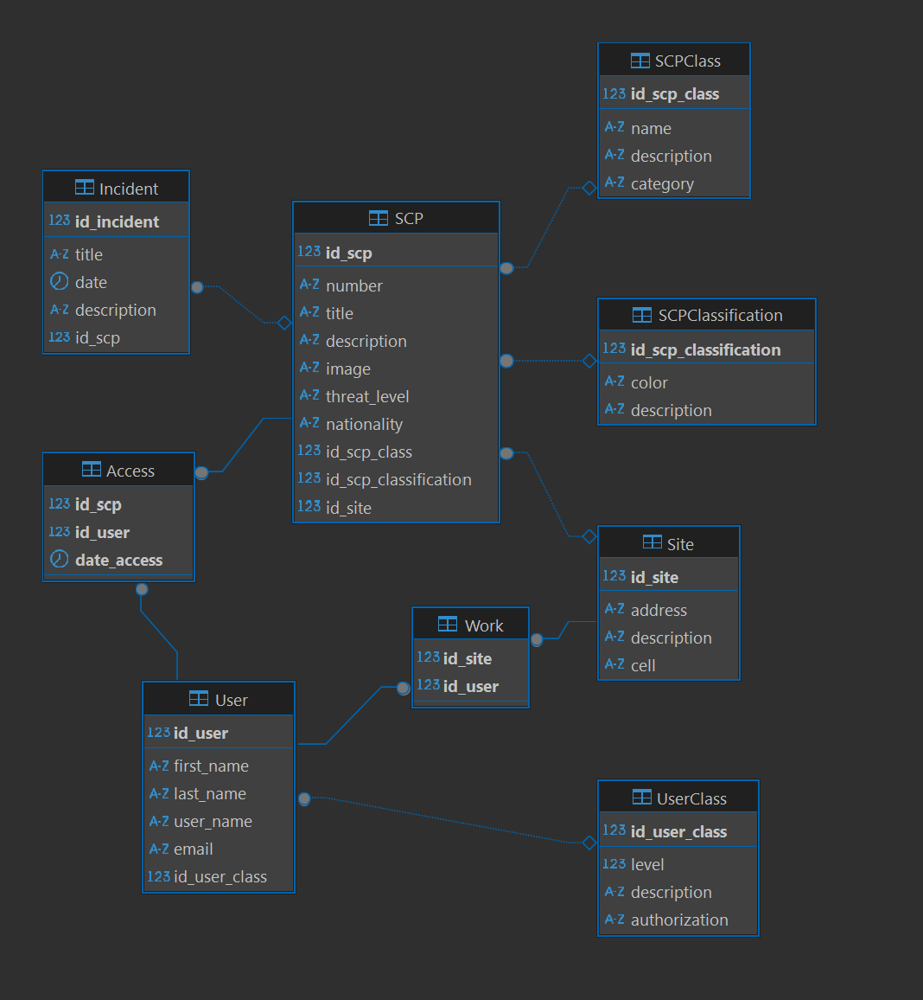
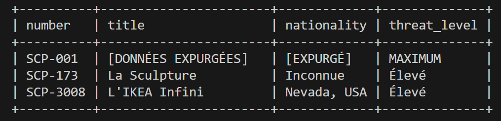

# SCP Database Setup and Query Guide

## 🚀 **Introduction**

Ce projet utilise **Docker** pour déployer une base de données **MySQL** qui contient des informations sur les SCPs, les utilisateurs, les incidents, etc. Ce guide explique comment démarrer le conteneur MySQL et interagir avec la base de données en utilisant différents outils et méthodes.

### 📊 **Schéma de la base de données**

Voici le schéma complet de la base de données `scp_db` montrant les relations entre les tables :



La base de données est organisée autour des entités principales :

- **SCP** : Les objets anormaux avec leurs classifications et sites de confinement
- **User** : Le personnel de la Fondation avec leurs niveaux d'autorisation
- **Incident** : Les événements liés aux SCPs
- **Access** : Les logs d'accès aux dossiers SCP
- **Work** : Les affectations du personnel aux sites

## 🛠️ **Prérequis**

- **Docker** installé sur votre machine
- **docker-compose** installé (si nécessaire)

## 📁 **Structure du projet**

```
BDD-CNAM-2025/
├── Cahier_des_charges_Projet_libre.pdf  # Cahier des charges du projet
├── docker-compose.yml                   # Configuration Docker
├── README.md                            # Guide d'utilisation
├── db/
│   └── init.sql                         # Script d'initialisation de la base
└── img/
    ├── schema.png                       # Schéma de la base de données
    └── ...                              # Autres images
```

---

## 🧑‍💻 **Lancer la base de données MySQL**

### 1. **Cloner le projet**

Si vous ne l'avez pas encore fait, clonez ce projet sur votre machine :

```bash
git clone https://github.com/votre-utilisateur/mon-projet-scp.git
cd mon-projet-scp
```

### 2. **Démarrer MySQL avec Docker**

Dans le dossier du projet, exécutez :

```bash
docker-compose up --build
```

Cela va :

- Lancer un conteneur Docker avec MySQL
- Créer la base de données `scp_db`
- Exécuter le script d'initialisation (`init.sql`)

Le conteneur sera disponible sur le port `3306` de votre machine locale.

---

## 🔑 **Se connecter à la base de données**

Il y a plusieurs façons de se connecter à la base de données et de faire des requêtes SQL.

### 1. **Se connecter via le terminal Docker**

Exécutez cette commande pour accéder à MySQL à l’intérieur du conteneur Docker :

```bash
docker exec -it scp-mysql mysql -u scp_user -p
```

Il vous demandera le mot de passe : `scp_password`.

Une fois connecté, vous pouvez choisir la base de données avec :

```sql
USE scp_db;
```

Ensuite, vous pouvez exécuter des requêtes SQL. Par exemple :

```sql
SELECT * FROM SCP;
```

Pour quitter le shell MySQL, utilisez :

```sql
exit;
```

---

### 2. **Se connecter avec un outil graphique (ex. : MySQL Workbench)**

Vous pouvez utiliser un outil graphique comme **MySQL Workbench**, **DBeaver**, ou **TablePlus** pour interagir avec la base de données.

#### **Paramètres de connexion :**

- **Host** : `127.0.0.1`
- **Port** : `3306`
- **User** : `scp_user`
- **Password** : `scp_password`
- **Database** : `scp_db`

Une fois connecté, vous pouvez exécuter vos requêtes SQL directement depuis l'interface graphique.

---

## 📊 **Exemples de requêtes SQL**

Voici quelques exemples de requêtes SQL que vous pouvez exécuter sur la base `scp_db` :

### 1. **Lister tous les SCPs**

```sql
SELECT * FROM SCP;
```



Cette requête affiche tous les SCPs de la base de données avec leurs informations complètes : numéro, titre, description, classe, classification et site de confinement.

### 2. **Trouver les incidents liés à un SCP spécifique**

```sql
SELECT * FROM Incident WHERE id_scp = 1;
```

### 3. **Lister tous les utilisateurs avec leur classe d'utilisateur**

```sql
SELECT u.first_name, u.last_name, uc.level
FROM `User` u
JOIN UserClass uc ON u.id_user_class = uc.id_user_class;
```

### 4. **Lister tous les accès d'un utilisateur à un SCP**

```sql
SELECT a.date_access, s.number, s.title
FROM Access a
JOIN SCP s ON a.id_scp = s.id_scp
WHERE a.id_user = 1;
```

### 5. **Consulter les accès suspects pour détecter des activités anormales**

```sql
SELECT
    a.date_access,
    CONCAT(u.first_name, ' ', u.last_name) as user_name,
    s.number as scp_accessed,
    uc.description as user_class
FROM Access a
JOIN `User` u ON a.id_user = u.id_user
JOIN SCP s ON a.id_scp = s.id_scp
JOIN UserClass uc ON u.id_user_class = uc.id_user_class
WHERE s.number = 'SCP-001'
ORDER BY a.date_access DESC;
```

### 6. **Vérifier les incidents de sécurité récents**

```sql
SELECT i.title, i.date, i.description, s.number as scp_number
FROM Incident i
JOIN SCP s ON i.id_scp = s.id_scp
WHERE i.title LIKE '%accès non autorisé%' OR i.title LIKE '%CRITIQUE%'
ORDER BY i.date DESC;
```

### 7. **Rechercher des SCPs par localisation géographique**

```sql
SELECT number, title, nationality, threat_level, description
FROM SCP
WHERE nationality LIKE '%Nevada%' OR nationality LIKE '%USA%'
ORDER BY threat_level DESC;
```

### 8. **Consulter les témoignages de survivants pour un SCP spécifique**

```sql
SELECT i.title, i.date, i.description
FROM Incident i
JOIN SCP s ON i.id_scp = s.id_scp
WHERE s.number = 'SCP-3008'
  AND (i.title LIKE '%témoignage%' OR i.title LIKE '%survivant%')
ORDER BY i.date DESC;
```

---

## 📊 **Exemples de scénarios d'utilisation**

Voici quelques scénarios plus concrets pour l'utilisation de la base `scp_db` :

### 📝 **Scénario 1 – Accès aux incidents selon la classe utilisateur**

**Contexte :**  
Un chercheur (Dr. Carter, Classe B) souhaite consulter les incidents liés à un SCP (ex : SCP-173).  
Grâce au moteur de recherche, il filtre les rapports selon la classification du personnel.  
Si un incident est classé au-dessus de son niveau (Classe A), il reçoit une alerte :

> "Alerte : ce fichier dépasse votre niveau. Demandez une autorisation temporaire."

---

### ⚙️ **Utiliser la procédure stockée du scénario 1**

Une procédure stockée nommée **GetSCPIncidentsIfClassA** permet de lister les incidents liés à un SCP, mais **seuls les utilisateurs de Classe A (level = 5) peuvent voir les détails**.  
Les autres reçoivent un message d’alerte.

#### **Appeler la procédure stockée**

1. **Connectez-vous à MySQL** (voir plus haut pour la connexion via Docker ou DBeaver).
2. **Sélectionnez la base** :
   ```sql
   USE scp_db;
   ```
3. **Appelez la procédure** en remplaçant `id_user` par l’ID de l’utilisateur et `'SCP-173'` par le numéro du SCP voulu :
   ```sql
   CALL GetSCPIncidentsIfClassA(id_user, 'SCP-173');
   ```
   - Si l’utilisateur est Classe A, la liste des incidents s’affiche.
   - Sinon, un message d’alerte est retourné.

#### **Trouver l’ID d’un utilisateur**

Pour connaître les IDs disponibles :

```sql
SELECT id_user, first_name, id_user_class FROM `User`;
```

---

### 🚨 **Scénario 2 – Tentative d'intrusion dans la base de données**

**Contexte :**  
Michael Thompson, technicien en cybersécurité de Classe C, reçoit une alerte urgente : une activité suspecte a été détectée sur la base de données SCP.

🚨 **"Tentative d'accès non autorisé détectée. Fichier ciblé : SCP-001. Source : inconnue."**

Michael consulte les logs de connexion et remarque quelque chose d'étrange : la tentative ne vient pas d'un hacker extérieur, mais d'un terminal situé à l'intérieur du Site-19. Encore plus troublant, l'utilisateur semble être le Dr. Hayward, un chercheur de Classe B supposé être décédé il y a trois ans lors d'un incident de confinement.

Le système de sécurité enclenche immédiatement un protocole de verrouillage, empêchant toute autre tentative d'accès. Michael déclenche une procédure d'alerte et une équipe de sécurité de Classe A est envoyée pour identifier l'origine de cette activité... et découvrir si le Dr. Hayward est vraiment mort.

---

### 🔍 **Scénario 3 – Agent de terrain utilisant la base pour survivre**

**Contexte :**  
L'Agent Ramirez, membre du personnel de Classe C, est envoyé en mission sur le terrain pour enquêter sur une série de disparitions inexpliquées dans une petite ville du Nevada. Les habitants parlent d'un étrange phénomène touchant certains voyageurs qui s'arrêtent dans un magasin de meubles isolé.

Avant d'entrer dans le magasin, Ramirez consulte la base de données via son terminal sécurisé. Il entre les mots-clés :

🔎 **"magasin de meubles"**

Un résultat remonte immédiatement : **SCP-3008 "L'IKEA Infini"**

- **Classe** : Euclide
- **Effet principal** : Toute personne entrant dans SCP-3008 devient incapable d'en ressortir. L'intérieur s'étend apparemment à l'infini.
- **Menace secondaire** : Entités humanoïdes hostiles ("employés d'IKEA") qui attaquent pendant la nuit.

Grâce à la base de données, Ramirez consulte les témoignages de survivants et découvre qu'une seule méthode d'évasion a fonctionné : certains ont trouvé des zones où la structure semblait instable, permettant parfois une sortie.

Ramirez fait demi-tour et contacte la Fondation. Une équipe de récupération est envoyée pour contenir le phénomène.

---

### ⚙️ **Utiliser les procédures stockées du scénario 3**

Le scénario 3 permet aux agents de terrain d'effectuer des recherches par mots-clés et de consulter les témoignages de survivants.

#### **Recherche par mots-clés**

La procédure `SearchSCPByKeywords` permet aux utilisateurs de Classe C et plus de rechercher des SCPs par mots-clés :

```sql
-- Recherche par mots-clés (Agent Ramirez, id_user = 7)
CALL SearchSCPByKeywords(7, 'magasin de meubles');
CALL SearchSCPByKeywords(7, 'disparition');
CALL SearchSCPByKeywords(7, 'infini');
```

#### **Consulter les témoignages de survivants**

La procédure `GetSurvivorTestimonies` affiche les témoignages et méthodes d'évasion documentées :

```sql
-- Voir les témoignages pour SCP-3008
CALL GetSurvivorTestimonies(7, 'SCP-3008');
```

**Exemple de scénario complet :**

1. L'Agent Ramirez effectue une recherche par mots-clés :

   ```sql
   CALL SearchSCPByKeywords(7, 'magasin de meubles');
   ```

2. Il consulte les témoignages de survivants pour SCP-3008 :

   ```sql
   CALL GetSurvivorTestimonies(7, 'SCP-3008');
   ```

3. Il peut aussi vérifier tous les incidents récents liés à SCP-3008 :

   ```sql
   SELECT i.title, i.date, i.description
   FROM Incident i
   JOIN SCP s ON i.id_scp = s.id_scp
   WHERE s.number = 'SCP-3008'
   ORDER BY i.date DESC;
   ```

4. Recherche géographique pour localiser les zones à risque :
   ```sql
   SELECT number, title, nationality, threat_level
   FROM SCP
   WHERE nationality LIKE '%Nevada%' OR nationality LIKE '%USA%'
   ORDER BY threat_level DESC;
   ```

---

## ⚙️ **Dépannage**

- **Erreur de connexion MySQL** : Vérifiez que le conteneur MySQL est bien en cours d'exécution avec `docker ps`. Si le conteneur est arrêté, relancez-le avec `docker-compose up`.
- **Problèmes de requêtes SQL** : Si vous rencontrez des erreurs lors de l'exécution des requêtes, assurez-vous d'être bien connecté à la base de données `scp_db` avec la commande `USE scp_db;`.

---

## 🧑‍💻 **Gestion des migrations et modifications de schéma**

Si vous devez modifier le schéma ou ajouter de nouvelles tables :

1. Modifiez le fichier `init.sql` avec les nouvelles instructions.
2. Redémarrez le conteneur avec `docker-compose down` puis `docker-compose up --build`.

Cela permettra de **recréer la base de données** avec les nouvelles modifications. (Note : toutes les données existantes seront perdues si vous redémarrez ainsi.)
